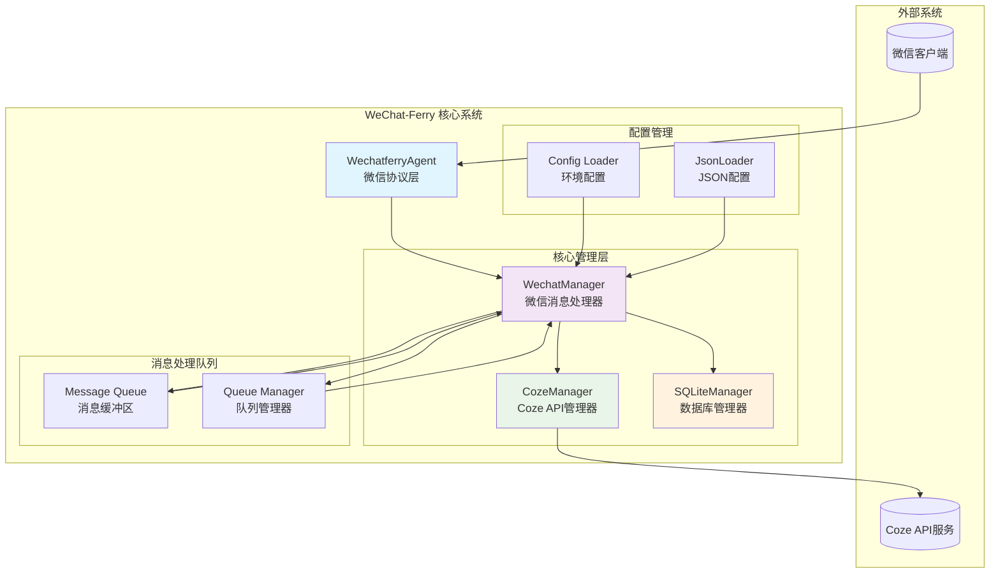
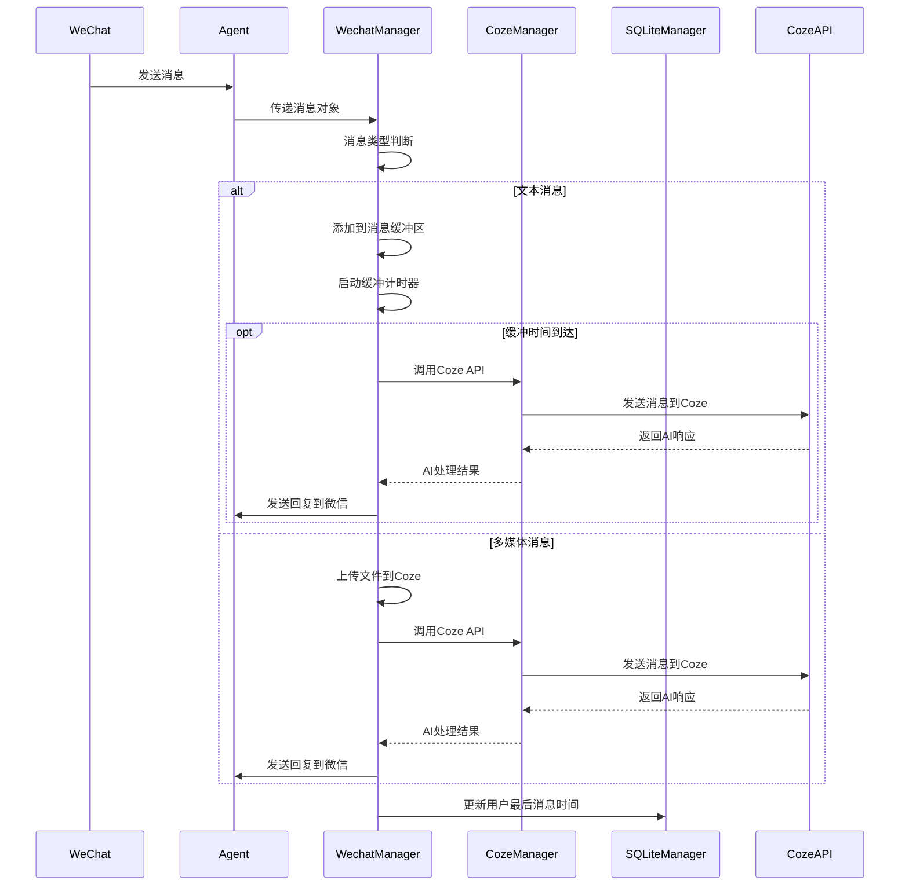
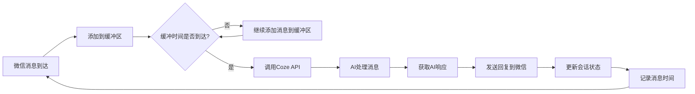

# WeChat-Ferry 架构图

## 系统架构概览

## 架构说明

WeChat-Ferry 采用模块化架构，主要分为以下几个层次：

1. **协议层**：WechatferryAgent 负责与微信客户端通信
2. **管理层**：WechatManager、CozeManager、SQLiteManager 分别处理不同职责
3. **配置层**：加载和管理各类配置
4. **队列层**：处理消息缓冲和异步队列

# 模块/代理职责

## 1. WechatferryAgent (微信协议代理)

### 职责
- 与微信客户端建立连接和通信
- 接收微信消息事件
- 发送微信消息到指定用户/群组
- 下载微信附件（图片、文件、语音等）

### 主要功能
- 消息监听 (`on('message')`)
- 登录状态管理 (`on('login')`)
- 消息发送 (`sendText`, `sendImage`, `sendFile`)
- 文件下载 (`downloadFile`)

## 2. WechatManager (微信消息管理器)

### 职责
- 处理各类微信消息（文本、图片、语音、视频、文件、表情、系统消息等）
- 管理消息队列和缓冲机制
- 调用Coze API进行AI处理
- 维护用户会话状态
- 处理特殊消息类型（引用回复、好友验证等）

### 主要功能
- 消息分类处理 (`handleTextMessage`, `handleImageMessage`, `handleVoiceMessage`等)
- 消息缓冲机制 (`addToMessageBuffer`, `processMessageBuffer`)
- 队列管理 (`enqueueHandleMessage`, `addSendWechatMsgQueue`)
- 敷衍回复机制 (`handleApologyReply`)
- 未读消息处理 (`handleUnreadMessage`)

## 3. CozeManager (Coze API管理器)

### 职责
- 管理Coze API的认证和连接
- 处理与Coze的对话交互
- 上传文件到Coze
- 执行Coze工作流
- 管理Coze会话

### 主要功能
- JWT Token管理 (`refreshToken`)
- 对话创建 (`chat`, `chatStream`)
- 文件上传 (`uploadFile`)
- 工作流执行 (`runWorkflow`)
- 语音转文字 (`audioTranscriptionsText`)

## 4. SQLiteManager (SQLite数据库管理器)

### 职责
- 管理本地SQLite数据库
- 存储会话信息
- 存储文件上传记录
- 存储用户消息时间戳

### 主要功能
- 数据表操作 (`forTable`)
- 记录增删改查 (`insert`, `find`, `update`, `delete`)
- 会话信息存储 (`coze_conversations`)
- 文件信息存储 (`coze_files`)
- 消息时间跟踪 (`wechat_recent_messages`)

## 5. 配置管理模块

### Config Loader
- 加载环境变量配置
- 支持不同环境（开发、测试、生产）

### Json Loader
- 管理JSON格式的配置文件
- 动态配置更新

# 代理间的消息流

## 1. 微信消息接收与处理流程

## 2. 消息队列处理机制

WeChat-Ferry 实现了多层消息队列处理机制：

### 用户消息处理队列
- 每个用户的消息单独排队处理
- 防止消息乱序
- 避免并发冲突

### 消息发送队列
- 每个用户的消息发送单独排队
- 模拟真实打字速度
- 防止消息发送冲突

### 消息缓冲机制
- 同一用户的连续消息合并处理
- 防止消息抖动
- 提升AI理解准确性

## 3. 会话状态管理流程

## 4. 特殊消息处理流程

### 敷衍回复机制
当AI响应时间较长时，系统会发送敷衍回复以改善用户体验：

1. 启动AI处理请求
2. 设置定时器
3. 定时器到期时，如果AI尚未响应，触发敷衍回复工作流
4. 敷衍回复优先发送给用户

### 好友验证处理
1. 接收到好友验证消息
2. 解析XML格式的验证信息
3. 调用Coze分析验证信息
4. 自动接受好友请求
5. 通知AI新好友信息

### 未读消息处理
1. 登录时检查上次退出后的新消息
2. 获取未读消息列表
3. 将未读消息提交给AI处理
4. AI根据上下文生成相应回复

这套架构确保了消息的可靠处理、用户会话的一致性以及良好的用户体验。