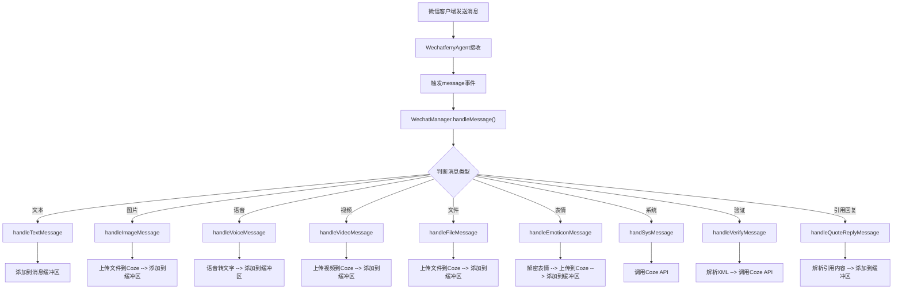
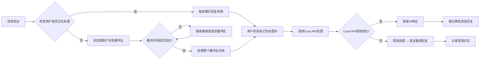
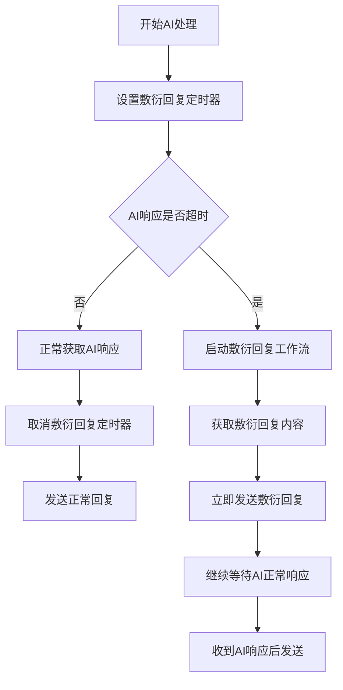
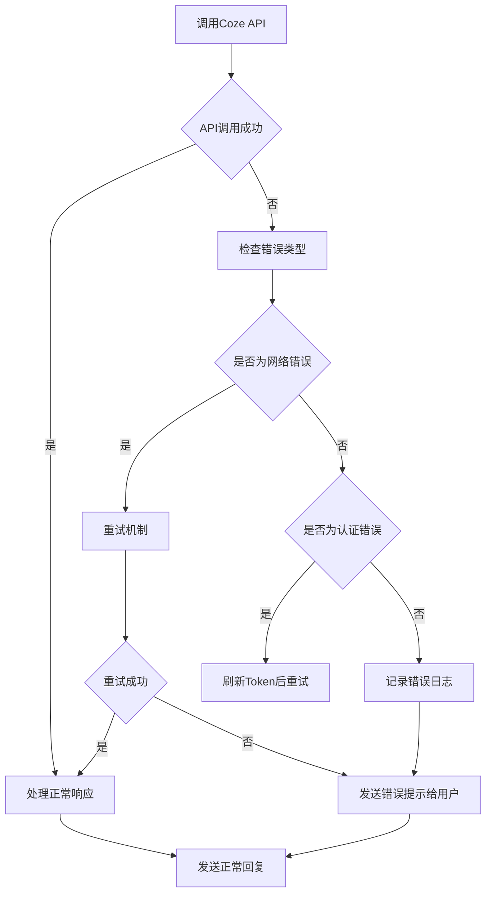

# WeChat-Ferry 消息流详解

## 1. 消息处理总览

WeChat-Ferry 实现了复杂的消息处理流水线，涵盖从微信消息接收、AI处理到回复发送的完整流程。整个消息流设计考虑了性能、一致性和用户体验。

## 2. 标准消息处理流程

### 2.1 微信消息接收与分发



### 2.2 消息缓冲与队列机制



## 3. 详细消息流分析

### 3.1 文本消息流

```
微信客户端 → WechatferryAgent → WechatManager.handleTextMessage() 
→ addToMessageBuffer() → processMessageBuffer() → CozeManager.chat() 
→ Coze API → AI响应 → cozeReplyTextMessage() → 微信回复
```

#### 步骤详解：
1. **消息接收**: 微信客户端发送文本消息
2. **消息分发**: Agent将消息传递给WechatManager
3. **类型判断**: 确认消息为文本类型
4. **缓冲处理**: 添加到用户的消息缓冲区
5. **定时处理**: 缓冲时间到达后批量处理
6. **AI处理**: 调用Coze API进行AI处理
7. **响应处理**: 处理AI返回的响应
8. **消息发送**: 通过微信发送回复给用户

### 3.2 多媒体消息流（以图片为例）

```
微信客户端发送图片 → WechatferryAgent → WechatManager.handleImageMessage() 
→ uploadFileToCoze() → 文件上传到Coze → addToMessageBuffer() 
→ processMessageBuffer() → CozeManager.chat() → Coze API 
→ AI响应 → cozeReplyTextMessage() → 微信回复
```

#### 步骤详解：
1. **消息接收**: 接收图片消息
2. **文件上传**: 将图片上传到Coze获取文件ID
3. **缓冲处理**: 将文件ID添加到消息缓冲区
4. **AI处理**: Coze使用文件ID进行内容分析
5. **响应处理**: 获取AI对图片的分析结果
6. **消息发送**: 将分析结果发送给用户

### 3.3 语音消息流

```
微信语音消息 → 语音文件下载 → 语音转文字 → 文本消息处理流程
```

#### 特殊处理：
- 语音消息首先转换为文本
- 然后按照文本消息流程处理
- 如果转换失败，使用备用消息

### 3.4 引用回复消息流

```
引用回复消息 → XML解析 → 提取引用内容 → 构建上下文 → AI处理
```

#### 处理逻辑：
- 解析引用回复的XML格式
- 提取被引用的消息内容
- 将引用内容和当前消息组合
- 提供给AI完整的上下文信息

## 4. 队列管理消息流

### 4.1 消息处理队列

```
用户A消息1 → [用户A队列] → 用户A消息2 → [用户A队列] → 按序处理
用户B消息1 → [用户B队列] → 用户B消息2 → [用户B队列] → 按序处理
```

### 4.2 消息发送队列

```
AI响应1 → [发送队列A] → AI响应2 → [发送队列A] → 按序发送给用户A
AI响应1 → [发送队列B] → AI响应2 → [发送队列B] → 按序发送给用户B
```

## 5. 特殊消息处理流

### 5.1 敷衍回复机制



### 5.2 未读消息处理流

```
系统启动 → 检查上次退出时间 → 获取未读消息 → 提交给AI处理 → AI生成上下文回复
```

### 5.3 好友验证处理流

```
好友验证请求 → XML解析 → 用户信息提取 → 图像分析（头像、背景） → AI分析验证信息 → 自动接受 → 通知AI
```

## 6. 错误处理消息流

### 6.1 API错误处理



### 6.2 消息发送错误处理

```
发送消息 → 检查发送状态 → {发送成功?} → |是| 结束 |否| 记录错误日志
```

## 7. 性能优化消息流

### 7.1 缓冲机制
- 防止消息抖动
- 合并连续消息
- 提升AI理解准确性

### 7.2 队列机制
- 防止消息乱序
- 避免并发冲突
- 保证处理一致性

### 7.3 打字速度模拟
- 根据消息长度计算打字时间
- 模拟真实用户交互
- 提升用户体验

## 8. 数据流向

```
微信消息 → WechatManager → 缓冲区 → CozeManager → Coze API → AI响应 
→ WechatManager → 消息队列 → 微信发送 → 用户接收
```

同时，处理过程中产生的数据也会流向：
- SQLite数据库（会话信息、文件信息、时间戳）
- 日志系统（处理日志、错误日志）
- 配置系统（动态配置更新）

这套消息流设计确保了消息的可靠处理、用户会话的一致性以及良好的用户体验。