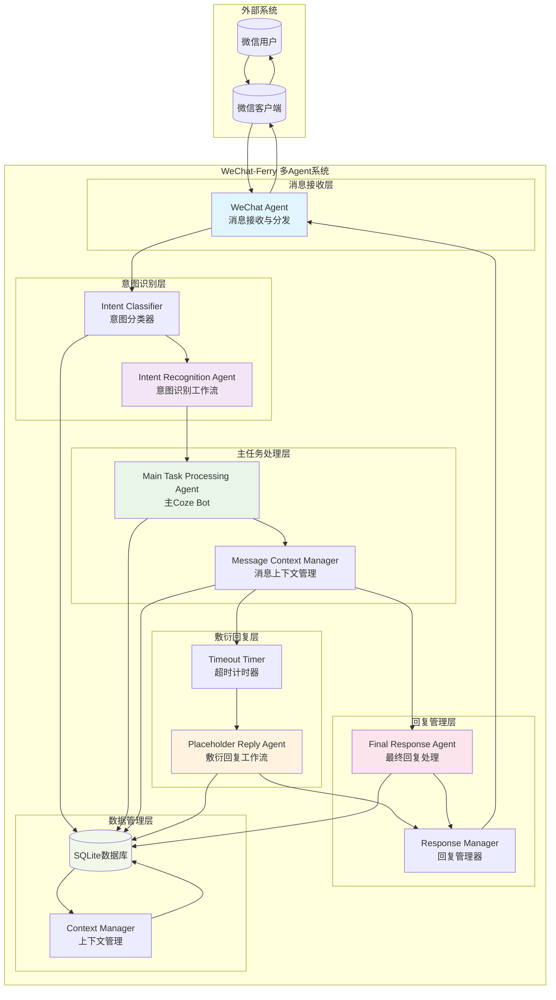
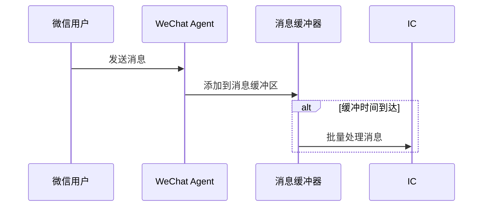
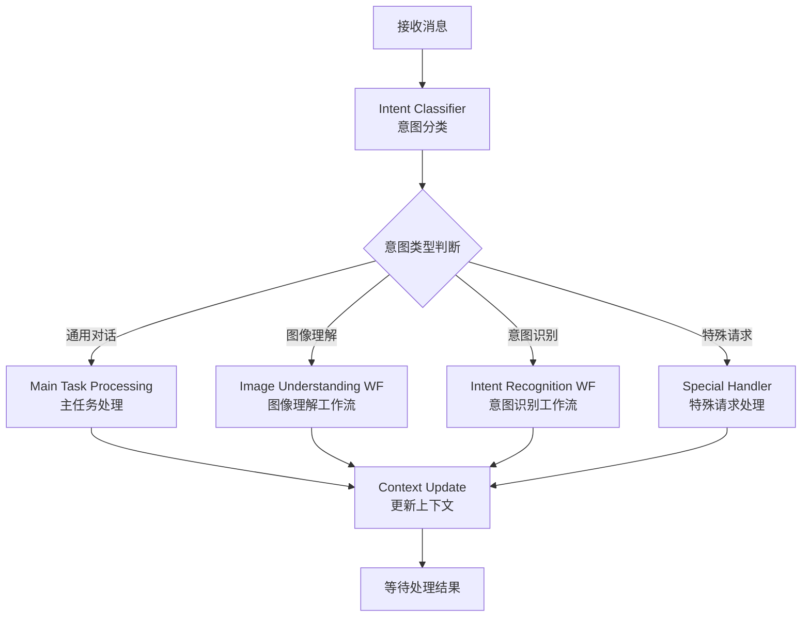
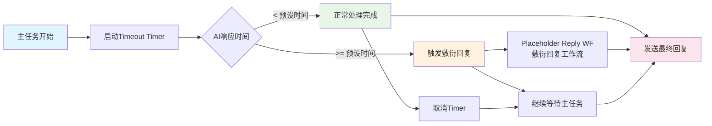
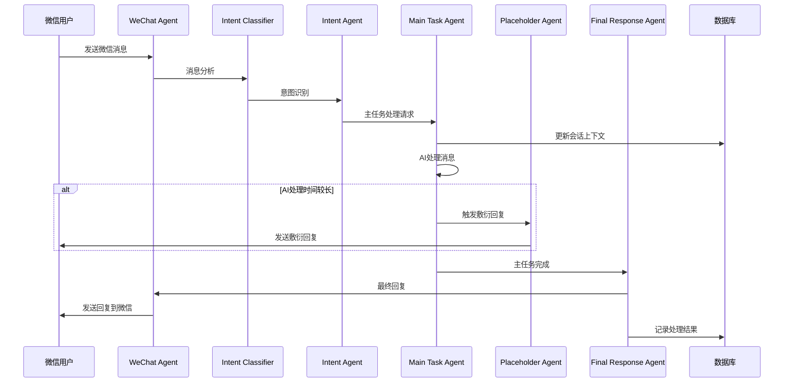

# WeChat-Ferry 多Agent架构图

## 多Agent系统概述

WeChat-Ferry 实现了一个多Agent协作系统，其中包含多个专业Agent协同工作，以提供智能化的微信消息处理服务。主要涉及以下几个核心Agent/工作流：

- **WeChat Agent**: 负责微信协议通信
- **Intent Recognition Agent**: 负责意图识别
- **Main Task Processing Agent**: 负责主任务处理
- **Placeholder Reply Agent**: 负责敷衍回复
- **Final Response Agent**: 负责最终任务回复

## 多Agent架构图

## 多Agent协作流程

### 1. 消息接收与分发

### 2. 意图识别工作流

### 3. 主任务处理与敷衍回复机制

### 4. 完整的多Agent交互流程

## Agent职责分工

### 1. WeChat Agent (微信代理)
- **职责**: 消息接收与发送
- **功能**:
  - 监听微信消息事件
  - 下载多媒体文件
  - 发送回复消息
  - 管理微信连接

### 2. Intent Recognition Agent (意图识别代理)
- **职责**: 消息意图分析
- **功能**:
  - 消息内容分析
  - 意图分类
  - 路由决策
  - 上下文理解

### 3. Main Task Processing Agent (主任务处理代理)
- **职责**: 核心AI处理
- **功能**:
  - 主要对话处理
  - 复杂任务执行
  - 上下文维护
  - 文件处理

### 4. Placeholder Reply Agent (敷衍回复代理)
- **职责**: 超时回复处理
- **功能**:
  - 超时检测
  - 占位回复生成
  - 用户体验维护
  - 等待主任务完成

### 5. Final Response Agent (最终回复代理)
- **职责**: 回复质量控制
- **功能**:
  - 回复内容整合
  - 质量检查
  - 发送时机控制
  - 用户体验优化

## 工作流协作机制

### 1. 消息缓冲与批处理
- 防止消息抖动
- 提升AI理解准确性
- 优化处理效率

### 2. 超时管理机制
- 配置化超时时间
- 自动触发敷衍回复
- 保证用户体验

### 3. 会话状态管理
- 持久化会话信息
- 上下文连贯性
- 用户个性化处理

### 4. 错误处理与恢复
- API调用重试
- 降级处理机制
- 错误日志记录

这个多Agent架构确保了WeChat-Ferry系统能够高效、可靠地处理复杂的微信消息交互场景，同时提供了良好的用户体验和系统稳定性。